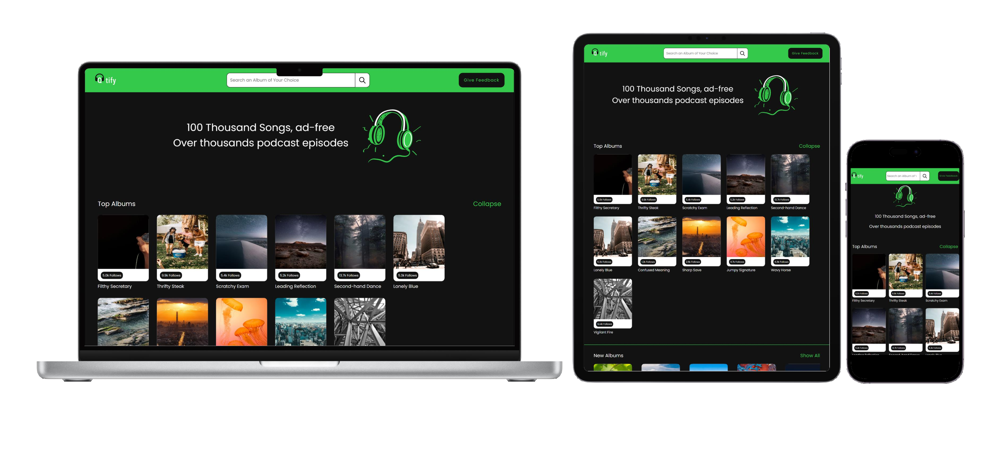
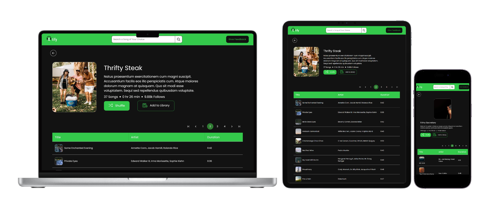

<h1 align="center">UNLEASH YOUR MUSICAL SPIRIT with <strong>Qtify</strong></h1>
<br />
<div>
      <h2>Overview</h2>
      <p>
        QTify is a song-browsing application built from scratch using ReactJS paired with Material UI and Swiper to deliver a seamless and aesthetic user interface, offering songs from different albums and genres for music lovers.
      </p>
      <p>While Building this Micro-Experience, the developer:</p>
      <ul>
        <li>
          Conducted a thorough analysis of the provided Figma design, successfully identifying and documenting required front-end components.
        </li>
        <li>Using this <i><a href="https://www.figma.com/file/tuCV26ozM1R75Ze6ShZxKs/Qtify?type=design&node-id=0-1&mode=design"> Figma design</a></i> the QTify website is constructed.</li>
        <li>
          Created modular UI components including Cards, Carousels, and Buttons optimizing for reusability across various sections of the application.
        </li>
        <li>
          Imlemented an intuitive genre-based song filtering system using a tab component by modifying the one provided by Material UI, allowing users to browse songs by their preferred genre effortlessy.
        </li>
        <li>Utilized axios to fetch data served by the backend server</li>
        <li>Deployed the website to Vercel</li>
        <li>To know more the details about the project click <a href="https://www.crio.do/learn/portfolio/rajkhairnar1499/ME_QTIFY/">Here</a></li>
      </ul>
    </div>

<hr />
    <div>
        <h3 align="center" >Responsive QTify</h3>
        
    </div>

<hr>

<h2>Project Demo</h2>
<div align="center">
      <p>Click the following link for the project demo</p>
      <h3>
        <a href="https://l-square-q-tify-rajkhairnar1499-crio.vercel.app/">Live Preview</a>
      </h3>
      <hr />
</div>


<h3>👨‍💻Technologies Used</h3>

1. React
2. Axios
3. React Router
4. React audio player
5. React feather
6. Material UI
7. Styled Components
8. Swiper
9. Notistack
10. HTML5
11. CSS3


<br />

<hr />
    <div>
      <h3>🚀 Features</h3>
      <ol>
        <li>Responsive Design To Support All Screen</li>
        <li>User Can Search the specific genre albums in the SeachBar</li>
        <li>User can give the Feedback about the website in the Feedback Modal</li>
        <li>User can use the Collapsable Carousel or the album slider</li>
        <li>Play/Pause is implemented in the Music Player Section</li>
        <li>Album page pagination allows users to navigate through albums easily</li>
      </ol>
    </div>

<hr />

<h2>Screenshots</h2>

<h4 align="center">1. Home Page</h4>

<h4 align="center">2. Carousel</h4>
    

<h4 align="center">3. Feedback Modal</h4>
    

<h4 align="center">4. SearchBar</h4>
    
<h4 align="center">5. Pagination</h4>
    
<h4 align="center">6. Music Player</h4>
    

<hr />

<h2>Installation</h2>

Clone the project

```bash
  git clone <repo_link>
```

Go to the project directory

```bash
  cd my-project
```

Install dependencies

```bash
  npm install
```

Start the server

```bash
  npm run start
```

<hr />

<h2>Future Implementations</h2>

- Building the proper backend **API to fetch song** data.
- Implementing all the features of the music player: **previous song, next song, shuffle, repeat**, etc.
- Integrating authentication features such as **login/logout** with password reset functionality.
- Most importantly, implementing the Route Protection feature for secure website routing.

<hr>

<h2>Contact</h2>

If you have any questions, feedback, or suggestions, feel free to reach out Using the following Medium:
- [Email](shimpishubham4@gmail.com)
- [Github Profile](https://github.com/Rajkhairnar1499)
- [LinkedIn](https://www.linkedin.com/in/shubham-shimpi-884b821a2/)
- [Twitter](https://twitter.com/ShubhamShimpi24)

<hr />

<h2>Thank You</h2>

<p>Thank you for checking out my project! As a fresher, this project is crucial for my career, especially in interviews. If you found it helpful, please consider giving it a <strong>Star
</strong> on GitHub. Your support means a lot and helps me stand out. Thank you!</p>

<hr />
<hr />
